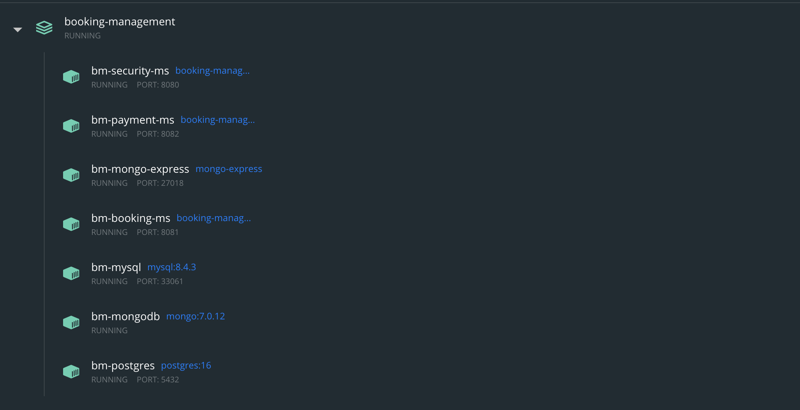

# booking-management

## Overview
booking-management is a system designed to manage users, bookings, and payments for events. It comprises three microservices (users, bookings, and payments), all orchestrated using Docker Compose to streamline deployment and communication between services.

## Architecture

### Microservices
* Security Microservice (security-ms) Handles user authentication, registration, and profile management.
* Bookings Microservice (booking-ms) Manages event creation, booking processes, and event updates.
* Payments Microservice (payment-ms) Processes payments and updates booking statuses based on payment results.

### Technology Stack
* Backend: Node.js (TypeScript)
* Database: MongoDB, Mysql And Postgresql
* Containerization: Docker
* Authentication: JWT
* Dependecy container: inversify

### Project Structure

```bash
├── docker-compose.yml
├── docs
│   ├── commit-message.png
│   └── postman-variables.png
├── scripts
│   ├── mysql
│   └── postgres
└── services
    ├── booking-ms
    ├── payment-ms
    └── security-ms
```

## Prerequisites
* Node.js v20
* Docker and Docker Compose installed

## Setting Up the Project

1. Clone the Repository:

    ```bash
    git clone https://github.com/your-repo/booking-management.git
    cd booking-management
    ```

2. Environment Configuration:
Replace the name of the file `.env-test` for `.env`. You don't need to change anything but feel free to customize variables

**NOTE:** no worries I know the .env should not be added in git repository, but this is a POC :D

3. Start Services:
Use Docker Compose to build and run all microservices:

    ```bash
    docker-compose up -d
    ```

your docker desktop should look like this:


4. Access the Services:

* Users Microservice: http://localhost:8080/api/v1
* Bookings Microservice: http://localhost:8081/api/v1
* Payments Microservice: http://localhost:8082/api/v1

## Usage 

### Inter-Service Communication
Microservices communicate via REST APIs. For authentication, every request requires a valid JWT issued by the security-ms after login.

### API Documentation
* **Security Microservice**
    * SignUp: POST /users/sign-up
    * SignIn: POST /users/sign-in
* **Bookings Microservice**
    * Create event: POST /events
    * Move event: PUT /events/${eventId}/move
    * Comming soon: GET /events/comming-soon
    * Delete event: DELETE /events/${eventId}
    * Create booking: POST /bookings
    * My bookings: GET /my-bookings
    * Delete booking: DELETE /bookings/${bookingId}
    * Update booking status: PUT /bookings/status
* **Payments Microservice**
    * Create payment: POST /payments
    * My payments: GET /payments/my-payments

**NOTE:** Refer to the individual README files in each microservice directory for detailed endpoint documentation.

#### Postman Configuration
A Postman collection is available under the docs/ folder. Import the collection and set up variables as shown in the image below:


### Booking flow

1. Create new user
2. Login to get the TOKEN
3. Create new event
4. Request new booking
5. Get my-payments
6. Get my-bookings
7. Comming-soon


### Contribution
Feel free to contribute by opening issues or submitting pull requests. Ensure that new code follows the project's coding standards

## Future Enhancements

* Multiples rols for users
* Kafka to simulate better an asynchronous payment
* Refund feature when an event is cancel
