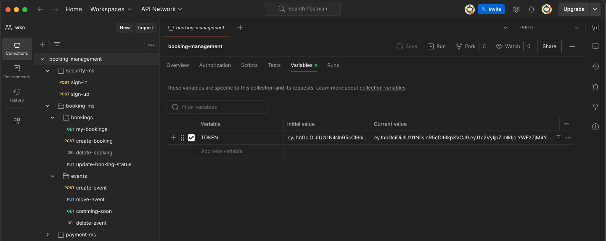

# booking-ms

## Overview

This microservice is to manage bookings and events, this microservice belongs to booking-management ms ecosystem, orchestrated using Docker Compose

## Project structure

```bash
├── application
│   └── services
│       ├── BookingAppService.ts
│       ├── EventAppService.ts
│       └── index.ts
├── domain
│   ├── entities
│   │   ├── Booking.ts
│   │   ├── Event.ts
│   │   └── index.ts
│   ├── repositories
│   │   ├── IBookingRepository.ts
│   │   ├── IEventRepository.ts
│   │   ├── IPaymentRepository.ts
│   │   └── index.ts
│   ├── services
│   │   ├── BookingService.ts
│   │   ├── EventService.ts
│   │   └── index.ts
│   └── value-objects
│       ├── BookingStatus.ts
│       └── index.ts
├── infrastructure
│   ├── api
│   │   ├── Server.ts
│   │   ├── controllers
│   │   │   ├── BookingController.ts
│   │   │   ├── EventController.ts
│   │   │   └── index.ts
│   │   ├── middlewares
│   │   │   ├── CommonMiddleware.ts
│   │   │   ├── ErrorMiddleware.ts
│   │   │   ├── JWTMiddleware.ts
│   │   │   └── index.ts
│   │   └── validators
│   │       ├── BookingValidators.ts
│   │       ├── EventValidators.ts
│   │       ├── Validation.ts
│   │       └── index.ts
│   └── repositories
│       ├── BookingRepository.ts
│       ├── EventRepository.ts
│       ├── PaymentRepository.ts
│       ├── config
│       │   ├── MongoConfig.ts
│       │   └── index.ts
│       └── index.ts
└── setup
    ├── DependencyContainer.ts
    ├── Envs.ts
    ├── Symbols.ts
    ├── index.ts
    ├── interfaces
    │   ├── DTOs
    │   │   ├── IBookingDTO.ts
    │   │   ├── IEventDTO.ts
    │   │   └── index.ts
    │   ├── ICommon.ts
    │   ├── index.ts
    │   └── models
    │       ├── IBookingModel.ts
    │       ├── IEventModel.ts
    │       └── index.ts
    ├── types.d.ts
    └── utils
        ├── Http.ts
        └── index.ts
```

## Prerequisites

* Node.js v20
* Docker

## Endpoints

URI: http://localhost:8081/api/v1

all endpoints needs JWT to autenticate, before call any endpoint you will have to get the `TOKEN` calling security-ms sign-in endpoint, then you can set the TOKEN in the Authorization header

If you're working with postman, we recommend use the Variables, it should looks like this:



### Events

* Create event
  - **URL**: `/events`
  - **Method**: `POST`
  - **Description**: Creates a new event
  - **Request Body**:
    ```json
    {
        "name": "Node.js DDD talk",
        "maxTotalAttenders": 20,
        "price": 50,
        "description": "Node.js talk about DDD",
        "details": {
            "contact": "3506602345",
            "dress_code": "no too fancy please :D"
        },
        "datetime": "2025-05-10 20:00:00"
    }
    ```
  - **Response**
      ```json
      {
      "id": "12345",
      "name": "Event Name",
      "date": "2024-12-10",
      "location": "Venue Address"
      }
      ```

* Move event
  - **URL**: `/events/${eventId}/move`
  - **Method**: `PUT`
  - **Description**: Reschedule the event to another date
  - **Request Body**:
    ```json
    {
        "datetime": "2026-03-20 15:00:00"
    }
    ```
  - **Response**
      ```json
      {
      "id": "12345",
      "name": "Event Name",
      "date": "2024-12-10",
      "location": "Venue Address"
      }
      ```

* Comming soon
  - **URL**: `/events/comming-soon`
  - **Method**: `GET`
  - **Description**: Fetch up to the next 20 events
  - **Response**
      ```json
      {
      "id": "12345",
      "name": "Event Name",
      "date": "2024-12-10",
      "location": "Venue Address"
      }
      ```

* Delete event
  - **URL**: `/events/${eventId}`
  - **Method**: `DELETE`
  - **Description**: Delete the event only if there are no bookings made
  - **Response**
      ```json
      {
      "id": "12345",
      "name": "Event Name",
      "date": "2024-12-10",
      "location": "Venue Address"
      }
      ```

### Bookings

* Create booking
  - **URL**: `/bookings`
  - **Method**: `POST`
  - **Description**: Request a booking for an specific event
  - **Request Body**:
    ```json
    {
        "eventId":  "6751f409b3da0328d9da0496"
    }
    ```
  - **Response**
      ```json
      {
      "id": "12345",
      "name": "Event Name",
      "date": "2024-12-10",
      "location": "Venue Address"
      }
      ```

* My bookings
  - **URL**: `/bookings/my-bookings`
  - **Method**: `GET`
  - **Description**: Get all bookings made by the current user
  - **Response**
      ```json
      {
      "id": "12345",
      "name": "Event Name",
      "date": "2024-12-10",
      "location": "Venue Address"
      }
      ```

* Delete event
  - **URL**: `/bookings/${bookingId}`
  - **Method**: `DELETE`
  - **Description**: Delete booking.
  - **Response**
      ```json
      {
      "id": "12345",
      "name": "Event Name",
      "date": "2024-12-10",
      "location": "Venue Address"
      }
      ```

* Update booking status (Called from payment-ms)
  - **URL**: `/bookings/status`
  - **Method**: `PUT`
  - **Description**: This request is called after the payment to update the booking status according to the payment status, if the payment was `APPROVED` it means booking-ms will recieved the status from payment and the booking will be approved same case for `DECLINED`
  - **Request Body**:
    ```json
    {
        "bookingId": "6750e44113d49bb0a3ac3779",
        "paymentId": "7217eb50-c2d7-414d-beef-87ec1476383e",
        "status": "DECLINED"
    }
    ```
  - **Response**
      ```json
      {
      "id": "12345",
      "name": "Event Name",
      "date": "2024-12-10",
      "location": "Venue Address"
      }
      ```
